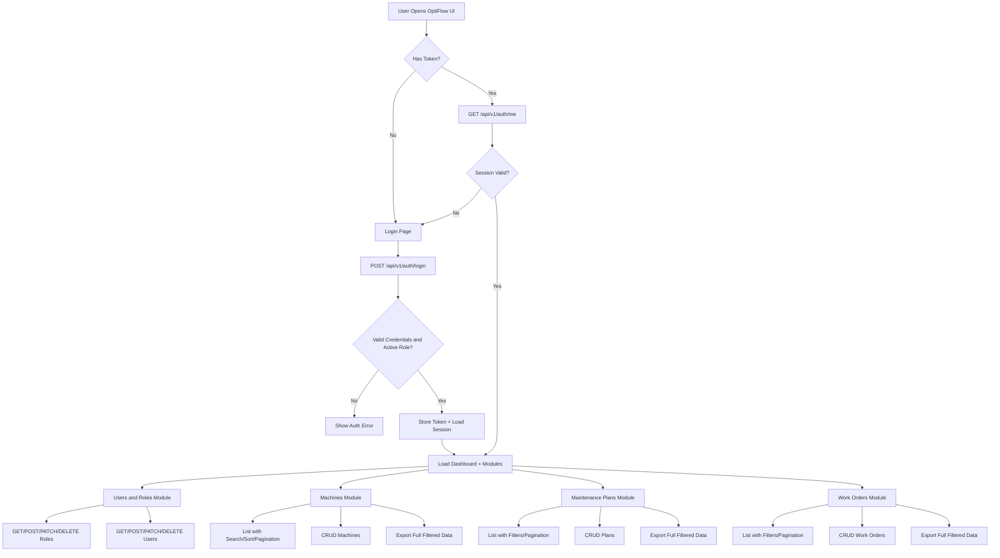
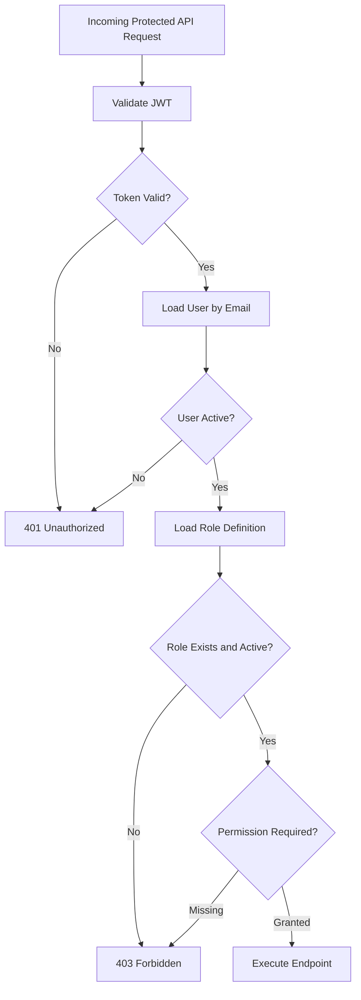
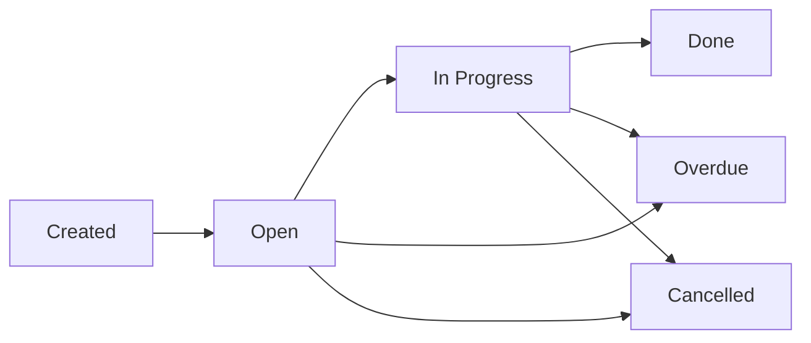
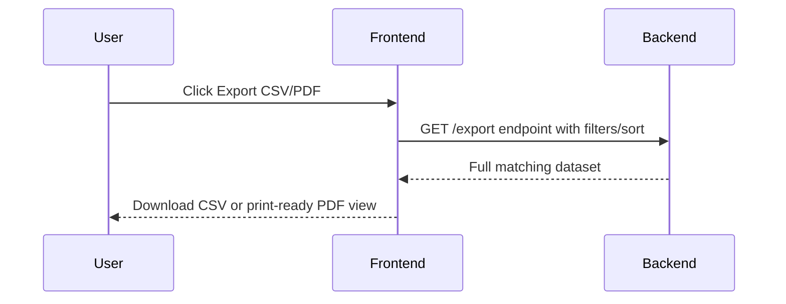
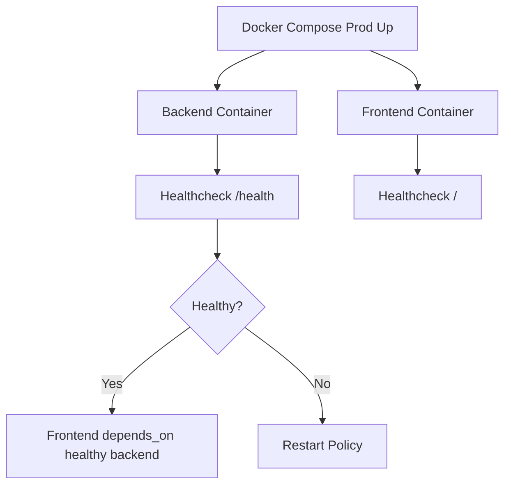

# OptiFlow SFC (System Flow Chart)

## 1. End-to-End System Flow

```mermaid
flowchart TD
  A[User Opens OptiFlow UI] --> B{Has Token?}
  B -- No --> C[Login Page]
  C --> D[POST /api/v1/auth/login]
  D --> E{Valid Credentials and Active Role?}
  E -- No --> F[Show Auth Error]
  E -- Yes --> G[Store Token + Load Session]
  B -- Yes --> H[GET /api/v1/auth/me]
  H --> I{Session Valid?}
  I -- No --> C
  I -- Yes --> J[Load Dashboard + Modules]
  G --> J

  J --> K[Users and Roles Module]
  J --> L[Machines Module]
  J --> M[Maintenance Plans Module]
  J --> N[Work Orders Module]

  K --> K1[GET/POST/PATCH/DELETE Roles]
  K --> K2[GET/POST/PATCH/DELETE Users]

  L --> L1[List with Search/Sort/Pagination]
  L --> L2[CRUD Machines]
  L --> L3[Export Full Filtered Data]

  M --> M1[List with Filters/Pagination]
  M --> M2[CRUD Plans]
  M --> M3[Export Full Filtered Data]

  N --> N1[List with Filters/Pagination]
  N --> N2[CRUD Work Orders]
  N --> N3[Export Full Filtered Data]
```

## 2. Authorization Decision Flow

```mermaid
flowchart TD
  A[Incoming Protected API Request] --> B[Validate JWT]
  B --> C{Token Valid?}
  C -- No --> D[401 Unauthorized]
  C -- Yes --> E[Load User by Email]
  E --> F{User Active?}
  F -- No --> D
  F -- Yes --> G[Load Role Definition]
  G --> H{Role Exists and Active?}
  H -- No --> I[403 Forbidden]
  H -- Yes --> J{Permission Required?}
  J -- Missing --> I
  J -- Granted --> K[Execute Endpoint]
```

## 3. Work Order Lifecycle Flow

```mermaid
flowchart LR
  A[Created] --> B[Open]
  B --> C[In Progress]
  C --> D[Done]
  B --> E[Overdue]
  C --> E
  B --> F[Cancelled]
  C --> F
```

## 4. Export Flow

```mermaid
sequenceDiagram
  participant U as User
  participant FE as Frontend
  participant BE as Backend

  U->>FE: Click Export CSV/PDF
  FE->>BE: GET /export endpoint with filters/sort
  BE-->>FE: Full matching dataset
  FE-->>U: Download CSV or print-ready PDF view
```

## 5. Deployment Flow

```mermaid
flowchart TD
  A[Docker Compose Prod Up] --> B[Backend Container]
  A --> C[Frontend Container]
  B --> D[Healthcheck /health]
  C --> E[Healthcheck /]
  D --> F{Healthy?}
  F -- Yes --> G[Frontend depends_on healthy backend]
  F -- No --> H[Restart Policy]
```
